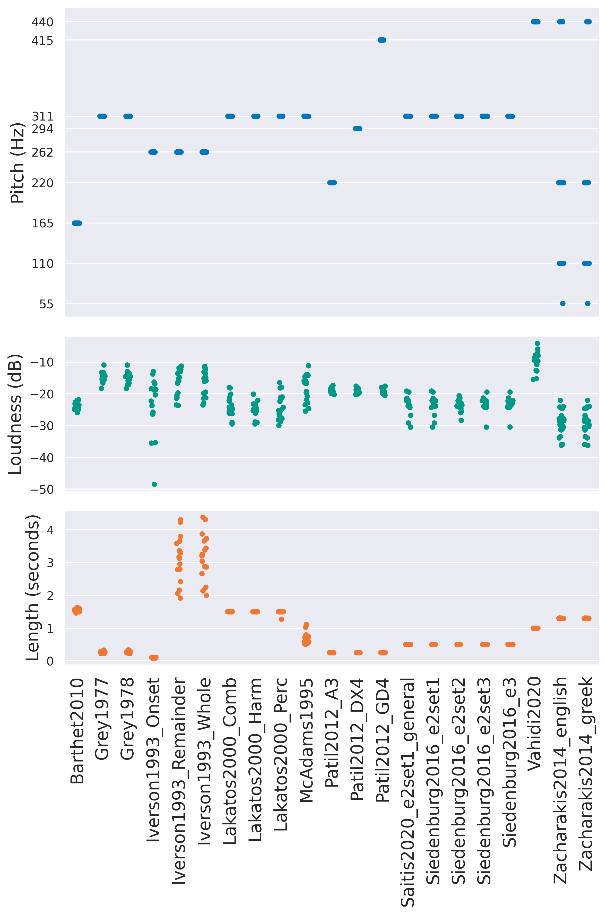

# Timbre Metrics

Measure how well your model’s audio embeddings match human timbre perception using 21 published datasets with audio files and their pairwise (dis)similarity ratings.

Below, human (dis)similarity ratings from three datasets are visualized as triangular matrices. Each point corresponds to a unique audio pair. A darker color indicates that the sounds are judged to be more dissimilar by human listeners.


These values represent perceptual timbre similarity, as in many cases, paired sounds are controlled to have the same pitch, loudness, and duration. 

Below is the pitch, loudness, audio length distributions of datasets. Pitch values are obtained from the original papers. Note that, `Iverson1993_Whole` and `Iverson1993_Perc` have non-pitched stimuli, while `Zacharakis2014_English` and `Zacharakis2014_Greek` have octave differences, with pitch ranging from A1 to A4. Loudness is computed using [pyloudnorm](https://github.com/csteinmetz1/pyloudnorm) with a block size of 0.08. The audio file lengths can serve as a reference for duration.



## Installation
Run
```
pip install git+https://github.com/tiianhk/timbremetrics.git
```
or, to install as an editable package
```
git clone https://github.com/tiianhk/timbremetrics.git
cd timbremetrics
pip install -e .
```
If you want to run Python scripts in the `examples/` folder to evaluate pre-trained neural networks like CLAP and signal processing based features such as the joint time-frequency scattering transform (jTFS), use `[extra]` to install additional dependencies:
```
pip install -e .[extra]
```
Python version 3.11.6 is recommanded if using pre-trained models with [fadtk](https://github.com/microsoft/fadtk).

## Usage
A minimal example
```
from timbremetrics import TimbreMetric, print_results

# initialization and data loading
metric = TimbreMetric()

# compute the metrics
results = metric(model)

# print the results
print_results(model_name, results)
```
The printed results for `model` that computes the MFCC (see `examples/evaluate_mfcc.py`)
```
mfcc:
  cosine:
    kendall_corr: 0.348
    mae: 0.287
    ndcg_retrieve_sim: 0.906
    spearman_corr: 0.448
    triplet_agreement: 0.724
  l2:
    kendall_corr: 0.342
    mae: 0.169
    ndcg_retrieve_sim: 0.905
    spearman_corr: 0.442
    triplet_agreement: 0.722
```
Some options
```
# load data to gpu
metric = TimbreMetric(device='cuda')

# the default sample rate is 44100 Hz, you can change it to suit your usecase
metric = TimbreMetric(sample_rate=48000)

# audio lengths are different, you can pad the shorter one to match the longer one when comparing two sounds
metric = TimbreMetric(pad_to_the_longer_length=True)

# you can pad or truncate all audio to a fixed duration
metric = TimbreMetric(fixed_duration=2.0)
```
The `model` should be a `Callable` (e.g., functions, methods, lambdas, or objects that implement the `__call__` method) and should produce embeddings for audio tensors of shape `(1, num_samples)`.
The output tensors must have the same shape to allow for pairwise distance computation.

If used during model training, it is recommended to initialize the object before training starts (e.g., in `__init__()` of a Lightning module) and use it to compute metrics once per validation epoch (e.g., in `on_validation_epoch_end()` of a Lightning module).

See [here](timbremetrics/metrics.py#L86-L110) for more options to initialize an object using the `TimbreMetric` class. For practical examples, check the files in `examples/`.

## Acknowledgement
Data source:
 - https://github.com/EtienneTho/musical-timbre-studies
 - https://github.com/ben-hayes/timbre-dissimilarity-metrics

Code:
 - Much of this work has been adapted from https://github.com/ben-hayes/timbre-dissimilarity-metrics
 - Some code was taken without modification from https://github.com/leymir/hyperbolic-image-embeddings
 - A complex autoencoder is trained and evaluated, using code from https://github.com/SonyCSLParis/cae-invar

Thanks to the authors for their work!
