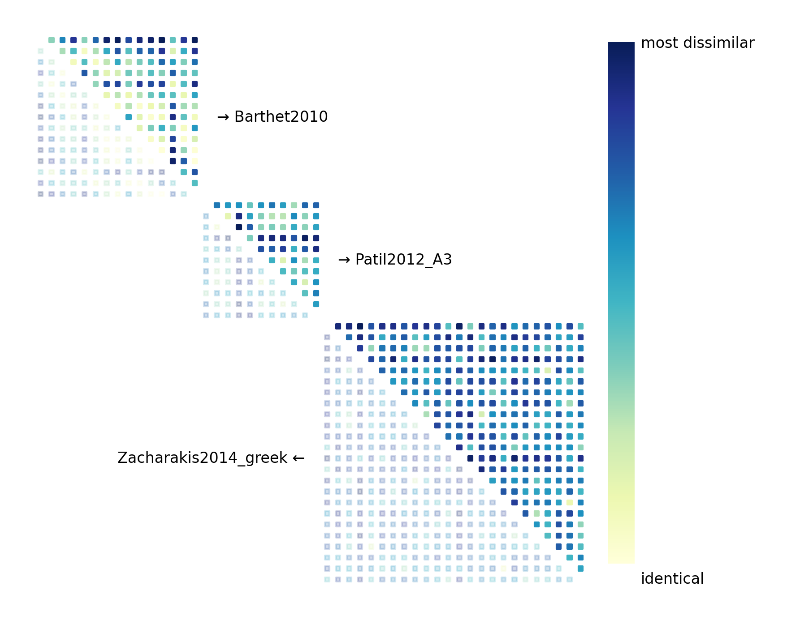

# Timbre Metrics

Measure how well your model’s audio embeddings match human timbre perception using 21 published datasets with audio files and their pairwise (dis)similarity ratings.

Below, human (dis)similarity ratings from three datasets are visualized as triangular matrices. Each point corresponds to a unique audio pair. A darker color indicates that the sounds are judged to be more similar by human listeners.



These values represent perceptual timbre similarity, as in nearly all cases, paired sounds are controlled to have the same pitch, loudness, and duration.

## Installation
Run
```
pip install git+https://github.com/tiianhk/timbremetrics.git
```
To install as an editable package
 - git clone this repository
 - cd into its directory
 - run
```
pip install -e .
```
If you want to run python scripts in the `examples/` folder to evaluate pre-trained models like CLAP and DSP models such as MFCC, run the following line to install with extra dependencies
```
pip install -e .[extra]
```
Especially, Python version 3.11.6 is recommanded for loading and using pre-trained audio models with the [Frechet Audio Distance Toolkit](https://github.com/microsoft/fadtk)

## Usage
```
from timbremetrics.metrics import TimbreMetric

metric = TimbreMetric(model)

evaluation_results = metric()
```
